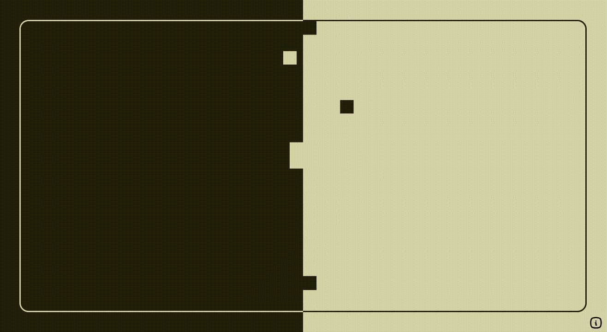

# Brainrot Pong aka. Doompong

A small fun project in JavaScript, inspired by Toffalini Leonardo's [ADHD Trap project](https://github.com/leonardo-toffalini/adhd-trap), written in LUA.

## Preview



## Config

YIt is possible to adjust some parameters via ``config.js`` and thus change the appearance and behavior.

```js
export default {
    "canvas": "gameCanvas",                 // Canvas Element ID
    "block_size": 42,                       // Window Width / Block Size
    "block_raster": false,                  // Show (=true) or hide (=false) raster lines
    "ball_size": 42,                        // Window Width / Ball Size
    "ball_speed": 3.5,                      // Speed Number between 1 (slow) and 10 (fast)
    "ball_rectangle": true,                 // Ball is rectangle (=true) or circle (=false)
    "colors": {                             // Define colors in RGB
        "block_white": [231, 230, 229],
        "block_black": [35, 33, 32],
        "block_raster": [0, 128, 0],
        "ball_white": [231, 230, 229],
        "ball_black": [35, 33, 32]
    },
    "scanline": {
        "active": true,                     // Show (=true) or hide (=false) CRT-Scanlines
        "animation": false,                 // Enable/Disable Scanline Flicking Animation (requires active=true)
        "opacity": 0.5,                     // Transparency for the scanlines from 0 to 1
    }
}
```

## Credits

- Inspired by Toffalini Leonardo's [ADHD Trap Repo](https://github.com/leonardo-toffalini/adhd-trap)
- All Icons from [tabler.io Icon Set](https://tabler.io/icons)
- JS Modal from [Micromodal.js](https://micromodal.vercel.app/)

## License

Copyright © 2025 Ludwig Jäschke <info@whydesign-halle.de>

This work is free. You can redistribute it and/or modify it under the 
terms of the Do What The Fuck You Want To Public License, Version 2,
as published by Sam Hocevar. See the COPYING file for more details.

For more, see the [LICENSE](./LICENSE.md) and [COPYING](./COPYING.md) files.